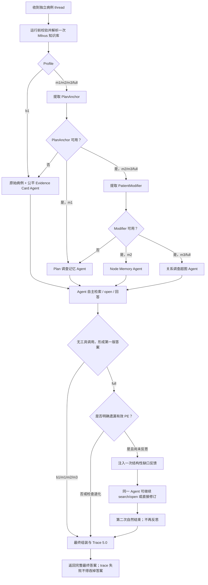

# Yuxi 升级方案 V4.2：关系调查超图版 PRIM-RAG 详细设计

> 版本定位：V4.1 的关系记忆修订与可实施设计稿  
> 方法名称：Patient–Regimen **Investigation** Memory-guided Agentic RAG（PRIM-RAG）  
> 中文名称：患者—治疗方案**调查记忆**引导的 Agentic RAG  
> 状态：仅设计，不包含本轮代码实现  
> 使用范围：老年患者完整治疗方案合理性审查的实验性研究，不构成临床用药结论

---

# 一、设计结论

V3/PAT-RAG 的在线实验已经证明，保留原生 Agent 自主检索，同时增加方案要素锚点、可读 Evidence Card 和一次覆盖补写，可以获得比完全自由探索更完整的回答，并在部分病例中检出更多问题。

V4.2 不推翻这个结果，也不再重新设计检索后端。它在 V3 基础上增加三类研究机制：

1. 将病例中明确的治疗方案要素和可回指原文的患者事实组织为稳定节点；
2. 由 Agent 在检索时动态提出病例特异性的关系问题，以稀疏调查超图组织多轮查询和候选 Evidence；
3. 当第一版答案发生明确的方案要素遗漏时，允许同一个 Agent 进行一次有界的二次调查，并仍可使用检索工具。

本方法的核心原则是：

> **程序保存关系调查的结构和历史，Agent 决定关系是否值得调查、如何检索以及最终具有何种临床意义。**

程序不得预生成治疗方案要素与患者事实的笛卡尔积，不得判断某个关系已经成立、已经解决或证据充分，不得判断检索片段是支持、反对还是条件性证据，也不得因为程序不能理解 Agent 的医学推理而删除或降级其结论。

V4.2 应作为一个新的实验 Agent 实现。已经在线验证的 `MedicationReviewLiteAgent`、`pat-rag-v1` 和 Trace 4.0 必须冻结，既用于复现实验，也作为 V4.2 的强基线。

---

# 二、研究问题与方法边界

## 2.1 研究问题

V4.2 的研究问题正式定义为：

> 在检索模型、知识库、Evidence Card、查询预算和主 Agent 模型相同的条件下，由 Agent 动态构建的患者—治疗方案关系调查超图，能否比节点清单或普通查询历史更有效地整合多药、多病和患者特异性条件，减少遗漏、重复查询和过早停止，同时不增加无依据的临床判断？

这里研究的不是“Agent 是否拥有记忆”。Yuxi 和 V3 已经通过 LangGraph 状态、消息历史、查询记录和 Evidence Store 保存运行信息。V4.2 新增的是：

- 将方案要素与患者事实作为可寻址节点；
- 将 Agent 自主提出的自然语言关系问题作为记忆的核心组织单元；
- 允许一个关系同时包含多个方案节点和多个患者节点；
- 将围绕同一关系进行的多次查询、查询改写和候选 Evidence 聚合在一起；
- 每轮以紧凑的关系调查超图重新展示；
- 第一版答案遗漏可以触发一次真正可检索的补救回合。

因此论文中不得声称“自由 Agent 没有持久状态”，而应表述为：

> 自由 Agent 的关系假设和调查进展主要隐含在不断增长的消息历史中，缺少显式、可寻址、可将多轮查询聚合到同一病例关系的调查结构。

## 2.2 研究假设

### H1：方案调查记忆

在公平 Evidence Card baseline 上，加入方案锚点及按方案组织的调查账本，可以提高：

- Plan Coverage；
- 完整 Finding 比例；
- Finding Micro-F1 和 Macro-F1；
- 完整病例正确率。

M1 同时包含“方案锚点可见”和“按方案组织的查询记录”。H1 解释为这个完整模块的效果，不分别声称锚点和账本具有独立贡献。

### H2a：患者事实节点

在 M1 基础上，仅加入可回指原文的 PatientModifier 节点和节点级关注记录，可以提高患者条件相关 Finding 的 F1，而不是只提高召回率。

必须同时观察：

- Modifier-linked Precision；
- Modifier-linked Recall；
- Modifier-linked F1；
- 无依据患者特异性结论率。

如果召回提高但假阳性显著增加，不能认定 H2a 成立。

### H2b：动态关系调查超图

在 PlanAnchor 和 PatientModifier 节点相同的条件下，将查询按 Agent 自主提出的关系问题组织为稀疏调查超图，相比只罗列节点和查询历史，可以提高：

- 多药物相互作用 Finding F1；
- 患者条件相关 Finding F1；
- 多因素整合 Finding F1；
- 单次新增查询的新增金证据收益；
- 已调查关系的跨轮复用率。

同时不得显著增加无依据关系判断。只有 `M3-Relation` 相对 `M2-Node` 获得增益，才能将结果归因于关系化记忆，而不是“向 Agent 多提供了一份患者事实清单”。

### H3：一次有界 Agent 反思

在 M3-Relation 基础上，第一版答案遗漏明确方案要素时，允许同一 Agent 进行一次额外调查，可以提高完整 Finding 比例和完整病例正确率，同时不显著增加：

- 无来源的具体替代方案；
- 伪造 Evidence；
- 查询成本；
- 运行失败率。

## 2.3 非目标

V4.2 明确不实现：

- 新的向量检索算法；
- BM25、重排或 LightRAG 混合实验；
- 药物×疾病、药物×风险的完整笛卡尔积；
- 预先枚举全部候选关系；
- 将共同检索过的节点自动判定为真实临床关系；
- 固定 `contraindication/interaction/dose/monitoring` 关系类型枚举；
- 固定临床审查槽位；
- 医学实体标准化词典；
- Evidence 支持/反对/条件性分类器；
- Evidence 适用性门控；
- Claim 二次抽取；
- 外部 LLM 审判 Agent；
- 程序化临床结论降级；
- 在线金标准或在线评价模型；
- 自动阻止语义相似查询；
- 前端专用可视化。

本轮检索后端固定为用户当前使用的单个 Milvus 向量知识库，单次检索固定 Top-5。

---

# 三、与当前 V3 的关系

## 3.1 V3 已经具备的能力

当前 `medication_review_lite` 已经提供：

- `PlanAnchor` 和一次 JSON 修复的锚点抽取；
- 原始病例驱动的 `create_agent` 工具循环；
- `search_review_kb` 和 `open_review_evidence`；
- 查询中心 Evidence Card；
- `SearchRecord`、`OpenRecord` 和 Evidence Store；
- PE 与 EV 的结构检查；
- Trace 4.0；
- M3 的一次无工具覆盖补写。

因此 V4.2 应优先复用这些已验证行为，而不是重写 Milvus 查询、Evidence ID、查询中心窗口和文档打开逻辑。

## 3.2 V3 尚未提供的能力

V3 的查询记录虽然存在于状态和 trace 中，但没有在每次模型调用前形成紧凑、对象可寻址的调查摘要。其 M3 还存在一个明确限制：

```python
tools=[]
```

覆盖补写模型只能使用已有 Evidence，不能针对遗漏内容再次检索。

V4.2 新增的实质能力应限定为：

1. 患者事实线索抽取；
2. 查询级 QueryRecord；
3. Agent 动态提出并复用的 RelationInvestigation；
4. 节点记忆与关系调查超图的分组回注；
5. 一次仍可调用工具的反思回合；
6. 对节点增益、关系组织增益和反思增益进行独立 trace 与消融。

## 3.3 冻结策略

不得直接把 V4.2 profile 追加到现有 V3 Agent 中，因为：

- 两套方法的 `m1/m2` 已具有不同实验含义；
- 修改 V3 会破坏已有在线结果的复现；
- Trace 4.0 无法准确表达 Modifier 和反思回合；
- 出现问题时难以判断是 V3 回归还是 V4 新机制错误。

应新建：

```text
MedicationReviewPrimAgent
method_family = "prim-rag-v1"
trace_schema_version = "5.0"
```

V3 保持：

```text
MedicationReviewLiteAgent
method_family = "pat-rag-v1"
trace_schema_version = "4.0"
```

---

# 四、方法形式化

V4 中“以关系组织记忆”的方向应当保留，但需要区分：

- **临床真实关系**：是否存在禁忌、相互作用、剂量调整或疗程影响，只有 Agent 结合 Evidence 后才能判断；
- **关系调查对象**：Agent 当前决定调查的一组病例对象和自然语言问题，可以由程序保存和复用。

V4.2 保存的是后者。它不是已确认的医学知识图谱，而是病例特异性的稀疏调查超图。

在第 \(t\) 轮，工作记忆表示为：

\[
\mathcal{M}_t =
\left(
P,\,
C,\,
R_t,\,
Q_t,\,
E_t,\,
D_t
\right)
\]

其中：

- \(P\)：病例中明确写出的治疗方案要素；
- \(C\)：来自病例原文的患者事实线索；
- \(R_t\)：截至第 \(t\) 轮由 Agent 动态创建的关系调查超边；
- \(Q_t\)：截至第 \(t\) 轮的查询级调查记录；
- \(E_t\)：已经返回的候选 Evidence；
- \(D_t\)：第一版草稿的结构性覆盖状态，仅在 Full 组反思阶段存在。

一条关系调查超边为：

\[
r_j =
\left(
\text{question}_j,\,
P_j,\,
C_j,\,
Q_j,\,
E_j,\,
\text{retrieval-status}_j
\right)
\]

其中：

- `question` 是 Agent 自主提出的自然语言关系问题；
- \(P_j\) 可以包含零个、一个或多个方案要素；
- \(C_j\) 可以包含零个、一个或多个患者事实；
- \(Q_j\) 是围绕该关系进行的一次或多次查询；
- \(E_j\) 是这些查询返回的候选 Evidence；
- `retrieval-status` 只描述检索过程，不描述医学结论。

关系至少应具有一个有效的可寻址节点，但不要求同时含有 PE 和 PM。未进入锚点的补充问题仍可作为普通 QueryRecord 检索和进入最终答案；PlanAnchor/PatientModifier 不是 Agent 允许发现内容的白名单，也不要求每次查询都创建关系。

一条查询记录为：

\[
q_i =
\left(
\text{text}_i,\,
\text{reason}_i,\,
P_i,\,
C_i,\,
E_i,\,
\text{status}_i
\right)
\]

每条查询可以从属于一个 RelationInvestigation，也可以在 B1、M1 或 M2-Node 中作为普通查询独立存在。一条关系可以拥有多条改写查询；同一组节点也可以因为 `relation_question` 不同而形成多条不同关系。

例如，`PE001 + PM001` 可以分别形成：

- “该患者条件是否构成当前药物禁忌或慎用条件？”
- “该患者条件是否只改变起始剂量和监测频率？”

系统不得根据节点集合或文本相似度自动合并二者。

必须强调：

- \(P_j\) 和 \(C_j\) 是 Agent 自报的关系参与对象；
- `relation_question` 是调查假设，不是已经成立的陈述；
- \(E_i\) 是该查询返回的候选片段；
- RelationInvestigation 不表示临床关系成立；
- 不表示 Evidence 与每个关注对象都相关；
- 不表示该问题已经调查充分。

Agent 策略仍为：

\[
a_t \sim
\pi_\theta
\left(
a \mid x,\mathcal{M}_t,o_{1:t}
\right)
\]

查询规划、Evidence 理解、患者适用性、最终判断和替代建议都由同一个 Agent 完成。

## 4.1 与通用工作记忆的区别

M2-Node 故意代表“通用结构化记忆”：

- 列出病例对象；
- 保存查询历史；
- 保存工具返回；
- 按时间或节点回注。

M3-Relation 在完全相同节点和 Evidence 上额外保存：

- Agent 当时要调查的病例特异性关系问题；
- 该关系涉及的一个或多个治疗方案节点；
- 该关系涉及的一个或多个患者事实节点；
- 围绕同一关系进行的查询改写；
- 每次查询返回的候选 Evidence；
- 该关系截至当前的纯技术性检索状态。

因此，二者的区别不是“有没有记忆”，而是记忆的主要索引单位：

| M2-Node 通用记忆 | M3-Relation 关系调查记忆 |
| --- | --- |
| 节点和查询是主要单位 | RelationInvestigation 是主要单位 |
| 查询主要按时间排列 | 多轮查询按同一关系聚合 |
| PE/PM 共同出现只表示本次关注 | `relation_question` 明确保存要调查的关系语义 |
| 无法区分同节点上的不同问题 | 同节点可以拥有多个不同关系问题 |
| 不直接表达多因素整合 | 一个超边可同时容纳多 PE、多 PM |

如果 M3 不能优于节点完全相同的 M2，就说明关系组织没有独立价值，PRIM 不应被解释为关系记忆方法。

---

# 五、实验分组

## 5.1 V4.2 主实验组

V4.2 新 Agent 提供五个 profile：

| Profile | Evidence Card | 方案节点 | 患者事实节点 | 查询关注对象 | 关系调查超图 | 一次 Agent 反思 |
| --- | ---: | ---: | ---: | ---: | ---: | ---: |
| `b1` | 是 | 否 | 否 | 否 | 否 | 否 |
| `m1` | 是 | 是 | 否 | PE | 否 | 否 |
| `m2` | 是 | 是 | 是 | PE + PM | 否 | 否 |
| `m3` | 是 | 是 | 是 | PE + PM | 是 | 否 |
| `full` | 是 | 是 | 是 | PE + PM | 是 | 是 |

profile 负责一次性选择合法组合，不再额外提供多个可产生任意组合的布尔开关。这样既可以完成消融，也能避免产生没有科学含义的运行模式。

### B1：公平运行 baseline

- 使用与其它组完全相同的 Milvus Top-5 工具；
- 使用相同查询中心 Evidence Card；
- 使用相同 search/open 预算；
- 使用相同最终输出任务；
- 不向 Agent 提供 PlanAnchor、PatientModifier 或紧凑调查账本；
- Agent 仍可从原始病例自主识别治疗方案并多轮检索。

B1 的消息历史仍会自然保留此前查询和工具结果。V4.2 不声称 B1“没有记忆”，而是没有结构化病例对象和关系调查超图。

### M1：Plan Investigation Memory

在 B1 基础上：

- 抽取并展示 PlanAnchor；
- 检索工具允许附带 `focus_plan_ids`；
- 每轮展示与 PE 对齐的历史查询、查询目的、返回 Evidence 和技术状态；
- 不自动为每个 PE 生成查询；
- 不要求每个 PE 都必须拥有 Evidence；
- 最终要求对每个有效 PE 给出一次明确评价。

### M2：Node Memory 对照

在 M1 基础上：

- 抽取并展示 PatientModifier；
- 检索工具允许附带 `focus_modifier_ids`；
- 普通 QueryRecord 可以记录本次查询关注的多个 PE 和多个 PM；
- 每轮展示节点清单和按时间排列的查询记录；
- 不创建 RelationInvestigation；
- 不将多次查询聚合为同一关系；
- 不向 Agent 提供 `relation_id` 或关系问题索引；
- 不进行 Evidence 资格判断。

M2 是必要的关系消融对照。它有与 M3 完全相同的 PlanAnchor 和 PatientModifier 节点，但只有通用节点记忆和查询历史。`M3 vs M2` 才能检验关系化组织是否具有独立价值。

### M3：Relation Investigation Hypergraph

在 M2 基础上：

- Agent 在发起检索时显式提出 `relation_question`；
- 系统创建稳定 `relation_id`；
- 一条关系可以包含多个 PE、多个 PM，形成调查超边；
- 同一关系的查询改写和补查通过 `relation_id` 聚合；
- 同一组节点可以因为关系问题不同而拥有多个 RelationInvestigation；
- 每轮按关系而非只按时间顺序回注调查进展；
- 系统只记录检索过程，不判定关系成立或解决。

M3 是完整 PRIM 关系记忆，但不包含覆盖反思。

### Full：PRIM-RAG

在 M3 基础上：

- 捕获第一版完整草稿；
- 只检查显式 PE 是否具有对应的逐项标题；
- 若发生明确遗漏，向同一 Agent 提供一次结构性反馈；
- Agent 可使用已有 Evidence、继续检索，或说明资料不足；
- 第二次自然结束后直接形成最终答案；
- 不允许触发第二次反思。

## 5.2 外部基线

主消融链为：

\[
B1 \rightarrow M1 \rightarrow M2\text{-Node}
\rightarrow M3\text{-Relation} \rightarrow Full
\]

另保留：

- `MedicationReviewLiteAgent/m3`：当前已在线成功的 V3 强基线；
- 原始 Yuxi Agent：生态 baseline，可选；
- token-matched generic checklist：只在少量开发病例中作为阴性对照，可选。

不建议把“其它病例的 Modifier 随机打乱后注入当前病例”作为主实验。它会主动注入错误患者事实，测到的可能只是错误上下文造成的伤害，而不是调查记忆的真实贡献。

如果全数据集运行五个 V4.2 profile 的成本不可接受，允许采用预注册的两层设计：

- 全数据集运行 B1、M1、M3、Full 和 V3-m3；
- 在运行结果揭盲前选定的复杂病例子集上额外运行 M2-Node；
- 只在该子集上检验 `M3-Relation vs M2-Node` 的关系组织效应。

但如果论文将关系记忆作为主要创新，不能完全省略 M2-Node；否则无法排除性能提升仅来自额外患者事实。

## 5.3 必须统一的实验条件

B1、M1、M2、M3、Full 必须统一：

- 主 Agent 模型及模型参数；
- 系统任务提示词中与方法无关的部分；
- Milvus 知识库及其快照；
- Top-5；
- 查询中心 Evidence Card 算法；
- Evidence Card 目标长度；
- 最大 search 次数；
- 最大 open 次数；
- 检索超时与技术重试；
- 上下文上限和消息保留策略；
- 最终输出章节要求；
- 每个病例独立 thread；
- 批处理并发策略；
- 运行超时。

PatientModifier 抽取消耗的 tokens、时间和费用必须计入 M2/M3/Full 总成本，不能从效率比较中排除。M3/Full 的关系结构不增加独立关系规划模型调用；关系问题由主 Agent 在原有 search 调用中提出。

---

# 六、状态与数据模型

## 6.1 PlanAnchor

V4.2 直接复用 V3 已验证的 PlanAnchor 语义和抽取器：

```python
class PlanAnchor(StrictModel):
    element_id: str
    source_span: str
    source_start: int
    source_end: int
    label: str
    kind: AnchorKind
```

PlanAnchor 表示病例明确写出的、最终需要审查的治疗方案内容，包括：

- 药物医嘱；
- 明确命名或描述的联合方案；
- 明确疗程、阶段或复评时点；
- 明确监测、随访、停药或换药安排；
- 其它原文明示的治疗方案要素。

它只负责防漏，不限制 Agent 添加未进入锚点的补充发现。

## 6.2 PatientModifier

PatientModifier 不保存临床诊断式的 `normalized_text`，运行时优先展示原文片段：

```python
class PatientModifierDraft(StrictModel):
    source_span: str = Field(min_length=1)


class PatientModifierEnvelope(StrictModel):
    modifiers: list[PatientModifierDraft] = Field(default_factory=list)


class PatientModifier(StrictModel):
    modifier_id: str
    source_span: str
    source_start: int
    source_end: int
```

抽取提示只要求：

> 从病例原文中找出可能影响当前治疗方案选择、剂量、疗程、相互作用风险、监测或疗效判断的明确患者事实。只复制最小但完整的原文片段，不要诊断、解释或评价这些事实，不要输出病例未提供的信息。

例如：

```text
允许：
[PM001] 卧位血压150/90 mmHg，立位110/70 mmHg并伴头晕

不允许：
[PM001] 明确体位性低血压
```

运行时结构校验只做：

- JSON Schema 校验；
- `source_span` 精确或空白规范化后回指原文；
- 完全重复片段去重；
- 按原文位置排序并分配稳定 ID；
- JSON 非法时最多进行一次格式修复；
- 单个无效条目局部丢弃。

程序不使用医学词典检查 Modifier 是否“正确”，也不根据数值阈值改写它。Modifier 的医学相关性和事实性在离线评价中审查。

病例没有提供某项检查，不得自动生成“肝肾功能缺失”等 Modifier，除非病例原文明确写出“未提供”“未检查”或同义事实。

## 6.3 QueryRecord

每次真实向量查询形成一条记录：

```python
class QueryRecord(StrictModel):
    query_id: str
    tool_call_id: str
    relation_id: str | None = None
    query_text: str
    reason: str
    focus_plan_ids: list[str] = Field(default_factory=list)
    focus_modifier_ids: list[str] = Field(default_factory=list)
    started_at: str
    elapsed_ms: int
    status: Literal[
        "success",
        "success_empty",
        "technical_failed",
    ]
    returned_count: int = 0
    retained_count: int = 0
    evidence_ids: list[str] = Field(default_factory=list)
    new_evidence_ids: list[str] = Field(default_factory=list)
    attempts: list[TechnicalAttempt] = Field(default_factory=list)
    invalid_focus_ids: list[str] = Field(default_factory=list)
    error_type: str | None = None
    error_message: str | None = None
```

设计约束：

- `relation_id` 只在 M3/Full 中使用；
- `focus_*_ids` 均为可选；
- Agent 未填写 ID 时检索正常执行；
- ID 非法时只从记录中剔除并写 warning，不拒绝查询；
- 不把多个 focus ID 展开成笛卡尔积；
- `success` 只表示检索成功返回片段；
- 不提供 `resolved`、`supported`、`clinically_relevant` 等语义状态。

## 6.4 RelationInvestigation

关系调查是 M3/Full 的核心记忆单元：

```python
class RelationInvestigation(StrictModel):
    relation_id: str
    relation_question: str
    focus_plan_ids: list[str] = Field(default_factory=list)
    focus_modifier_ids: list[str] = Field(default_factory=list)
    created_at: str
    query_ids: list[str] = Field(default_factory=list)
    evidence_ids: list[str] = Field(default_factory=list)
    new_evidence_ids: list[str] = Field(default_factory=list)
    retrieval_status: Literal[
        "attempted",
        "evidence_returned",
        "empty",
        "technical_failed",
        "mixed",
    ]
    warnings: list[str] = Field(default_factory=list)
```

### 创建和复用规则

`relation_id` 不使用依赖列表长度的顺序计数，以避免并行工具调用产生冲突。建议从创建该关系的首个 `tool_call_id` 确定性生成：

```python
relation_id = "RI-" + sha256(tool_call_id.encode("utf-8")).hexdigest()[:12].upper()
```

该 ID 不包含临床语义，只承担复用、trace 和并发安全作用。下文的 `RI001` 仅为便于阅读的示意。

第一次调查：

```python
search_review_kb(
    query_text="老年患者已有卧立位血压下降并伴晕厥史，使用特拉唑嗪的禁忌和监测建议",
    relation_question=(
        "当前患者的卧立位血压变化和既往晕厥史，"
        "是否改变特拉唑嗪的适用性、剂量或监测要求？"
    ),
    focus_plan_ids=["PE001"],
    focus_modifier_ids=["PM001", "PM002"],
    reason="调查患者特异性适用条件",
)
```

系统创建 `RI001`，并在工具结果中把该 ID 返回 Agent。

如果 Agent 认为结果不充分，可继续：

```python
search_review_kb(
    relation_id="RI001",
    query_text="已有体位性低血压老年人 α1受体阻滞剂 禁用 减量 替代治疗",
    relation_question=None,
    focus_plan_ids=["PE001"],
    focus_modifier_ids=["PM001", "PM002"],
    reason="针对禁用、减量和替代方案补查",
)
```

规则如下：

- 没有 `relation_id` 时，`relation_question` 必填并创建新关系；
- 新关系至少包含一个经过校验的 PE 或 PM；没有有效节点时查询仍执行，但只保存为普通 QueryRecord；
- 提供有效 `relation_id` 时，查询追加到现有关系；
- 对已有关系的后续查询可以省略 `relation_question`；
- 后续查询新增的有效 PE/PM 可并入该关系参与节点；
- 提供非法 `relation_id` 时，不拒绝检索；若有 `relation_question` 则创建新关系，否则将查询作为无关系 QueryRecord 并写 warning；
- 同一组节点可以创建多个不同关系；
- 系统不根据节点集合、查询相似度或 Evidence 自动合并关系；
- 关系的 `relation_question` 创建后保持不变，查询改写由各 QueryRecord 的 `query_text/reason` 表达；
- `retrieval_status` 由所属 QueryRecord 的技术状态确定性汇总；
- 不存在 `confirmed/resolved/supported/contraindicated` 等关系状态。

第一版不增加 `working_conclusion`、关系极性或单独的“更新关系结论”工具。Agent 对关系的当前理解保留在原生消息历史和最终回答中；关系记忆只保存调查问题、查询尝试和候选 Evidence。

`retrieval_status` 汇总规则固定为：

```text
尚无完成的 QueryRecord                         -> attempted
至少一条返回 Evidence，且其它查询均成功/为空     -> evidence_returned
全部查询均 success_empty                       -> empty
全部查询均 technical_failed                    -> technical_failed
成功、空结果和技术失败以其它方式混合              -> mixed
```

`query_ids/evidence_ids/new_evidence_ids` 使用去重并集 reducer，保证同一关系的串行或并行查询不会互相覆盖。RelationInvestigation 发生局部更新失败时，QueryRecord 和 Evidence Store 仍然保留，不能回滚真实检索结果。

### 支持的关系形态

关系参与节点数量不固定：

```text
药物—患者因素：
PE001 + PM001 + PM002

药物—药物—患者因素：
PE001 + PE003 + PM001

多药方案—多种患者条件：
PE001 + PE002 + PE003 + PE004 + PM003 + PM004 + PM005

方案方向—疗程—患者反应：
PE005 + PE006 + PM006
```

因此 RelationInvestigation 是超边，而不是二元边。

## 6.5 Node Memory 与 Relation Memory

调查记忆不是额外数据库表，也不需要维护第二份临床 CoverageEntry。它由当前状态中的 PlanAnchor、PatientModifier、QueryRecord 和 RelationInvestigation 确定性派生。

M2-Node 只注入节点和按时间排列的普通查询历史：

```text
【明确治疗方案要素】
[PE001] 特拉唑嗪 2 mg qn
[PE002] 非那雄胺 5 mg qd
[PE003] 氨氯地平 5 mg qd

【患者事实线索】
[PM001] 卧位血压150/90 mmHg，立位110/70 mmHg并伴头晕
[PM002] 既往起床时晕倒并发生股骨颈骨折

【既往调查记录】
[Q001] 关注 PE001、PM001、PM002
- 目的：评估当前患者使用特拉唑嗪的风险和处理建议
- 查询：老年患者已有卧立位血压下降并头晕，使用特拉唑嗪的禁忌、风险与监测建议
- 结果：success；返回 EV003、EV004、EV005

[Q002] 关注 PE001、PE003、PM001
- 目的：评估两种药物的叠加降压风险
- 查询：老年患者特拉唑嗪联合氨氯地平，体位性血压下降风险与用药建议
- 结果：success；返回 EV006、EV007

提示：以上只记录节点和查询历史，没有建立持久的关系调查对象。
```

M3/Full 将相同底层记录按关系组织：

```text
【关系调查超图】

[RI001]
参与对象：
- [PE001] 特拉唑嗪 2 mg qn
- [PM001] 卧位血压150/90 mmHg，立位110/70 mmHg并伴头晕
- [PM002] 既往起床时晕倒并发生股骨颈骨折

调查问题：
当前患者的卧立位血压变化和既往晕厥史，是否改变特拉唑嗪的
适用性、剂量或监测要求？

调查过程：
- [Q001] 老年患者已有卧立位血压下降并伴晕厥史，使用特拉唑嗪的禁忌和监测建议
  结果：success；返回 EV003、EV004
- [Q004] 已有体位性低血压老年人 α1受体阻滞剂 禁用 减量 替代治疗
  结果：success；返回 EV009

检索状态：evidence_returned

[RI002]
参与对象：
- [PE001] 特拉唑嗪
- [PE003] 氨氯地平
- [PM001] 卧立位血压变化并伴头晕

调查问题：
特拉唑嗪与氨氯地平联合是否在当前患者中造成叠加降压风险？

调查过程：
- [Q002] ……；返回 EV006、EV007

提示：
- RelationInvestigation 是 Agent 提出的调查问题，不代表临床关系成立；
- evidence_returned 只表示检索返回候选片段，不代表证据充分；
- 请自行决定继续查询、使用已有 Evidence 或形成有限结论。
```

必须显示 `relation_question`、真实查询文本和查询结果，而不只是 RI/Q ID。否则无法区分“相同节点上的不同关系”，也无法帮助 Agent 复用或改写既有调查。

不应显示：

- “该关系已经充分调查”；
- “RI001 已经解决”；
- “EV007 支持 PE001×PM001”；
- “PE003 尚未完成临床审查”；
- 由程序推断的风险类别。

可以显示的结构事实只有：

- 某 PE 尚无显式关联查询记录；
- 某 RelationInvestigation 包含哪些 Agent 自报的参与节点；
- Agent 为该关系提出的原始自然语言问题；
- 某关系已经包含哪些查询尝试；
- 某查询为空或技术失败；
- 某查询返回哪些候选 Evidence；
- 剩余预算。

即使某 PE 没有查询记录，Agent 仍可基于已有 Evidence 或常识边界直接评价；系统不得要求“一项一查”。

## 6.6 ReflectionReport

```python
class ReflectionReport(StrictModel):
    enabled: bool
    triggered: bool = False
    trigger_reason: str | None = None
    first_draft: str | None = None
    first_draft_hash: str | None = None
    missing_before: list[str] = Field(default_factory=list)
    search_count_before: int = 0
    search_count_after: int = 0
    open_count_before: int = 0
    open_count_after: int = 0
    evidence_ids_added: list[str] = Field(default_factory=list)
    missing_after: list[str] = Field(default_factory=list)
    completed: bool = False
    fallback_to_first_draft: bool = False
    warnings: list[str] = Field(default_factory=list)
```

保留第一版草稿正文是为了直接评价 H3，而不仅仅保存 hash。该字段只进入内部 trace，不额外展示给终端用户。

## 6.7 Agent State

```python
class MedicationReviewPrimState(BaseState, total=False):
    review_run_id: str
    requested_profile: ExperimentProfile
    effective_profile: ExperimentProfile
    raw_case_text: str
    raw_question_hash: str

    plan_anchors: list[PlanAnchor]
    plan_extraction: AnchorExtractionAudit
    patient_modifiers: list[PatientModifier]
    modifier_extraction: ModifierExtractionAudit

    evidence_store: dict[str, EvidenceItem]
    query_records: list[QueryRecord]
    relation_investigations: list[RelationInvestigation]
    open_records: list[OpenRecord]
    knowledge_base_snapshot: dict[str, Any]

    search_count: int
    open_count: int
    technical_attempts: int

    reflection_attempted: bool
    reflection_report: ReflectionReport
    draft_answer: str
    final_answer: str

    run_status: RunStatus
    warnings: list[str]
    errors: list[TraceError]
```

`requested_profile` 表示用户选择的组别，`effective_profile` 表示解析降级后本次真正执行的能力，二者必须同时进入 trace。

---

# 七、运行流程



## 7.1 运行前校验

只在 Agent 运行前执行一次：

1. 检查当前 thread 是否已经包含另一病例；
2. 检查 profile 是否与当前 thread 首次运行一致；
3. 检查恰好选择一个知识库；
4. 解析该知识库并确认其为 Milvus/vector；
5. 保存知识库快照和本轮可复用的 retriever 资源。

禁止在模型已经完成最终答案后再次解析或校验知识库。最终 trace 组装失败、配置对象在运行中变化或前端字段序列化异常，都不得用“必须选择一个 Milvus 知识库”覆盖已经生成的答案。

如果知识库配置确实非法，应在第一次模型调用之前失败。

## 7.2 病例初始化与降级

降级路径固定为：

```text
M2/M3/Full：
Plan 成功 + Modifier 成功 -> 按请求 profile 运行
Plan 成功 + Modifier 失败 -> effective_profile=m1
Plan 失败                -> effective_profile=b1

M1：
Plan 成功 -> m1
Plan 失败 -> b1

B1：
不执行对象抽取 -> b1
```

降级不得阻断最终回答。原始病例始终保留在消息中。

Modifier 返回空列表不一定是技术失败。如果病例确实没有可提取的患者事实，可记录 `no_valid_modifier` 并降级为 M1，同时保留该事实供实验分析。

## 7.3 每轮模型调用

每轮模型调用前动态构造提示：

1. 共同任务协议；
2. 当前 profile 和有效降级状态；
3. 可见的 PlanAnchor；
4. 可见的 PatientModifier；
5. 与 effective profile 对应的 Plan、Node 或 Relation Investigation Memory；
6. search/open 剩余预算；
7. 如处于反思阶段，加入第一版草稿和遗漏 PE；
8. 明确 RelationInvestigation 是调查问题、所有 Evidence 都是候选信息。

不得在动态提示中加入：

- 临床风险标签；
- 必查属性模板；
- 自动生成的替代药物；
- 程序判定的 Evidence 极性；
- “必须继续检索直到每个 PE 有证据”；
- “没有 Evidence 就不得评价合理”等语义门槛。

## 7.4 搜索工具

工具接口：

```python
async def search_review_kb(
    query_text: str,
    relation_question: str | None = None,
    relation_id: str | None = None,
    focus_plan_ids: list[str] | None = None,
    focus_modifier_ids: list[str] | None = None,
    reason: str = "",
    runtime: ToolRuntime[MedicationReviewPrimContext, MedicationReviewPrimState],
) -> Command:
    ...
```

底层工具实现可以使用上述统一参数，但为了避免对照组因看到额外关系字段而受到提示，模型侧工具 Schema 按 profile 投影：

```text
B1：
query_text, reason

M1：
query_text, reason, focus_plan_ids

M2-Node：
query_text, reason, focus_plan_ids, focus_modifier_ids

M3-Relation / Full：
query_text, reason, focus_plan_ids, focus_modifier_ids,
relation_question, relation_id
```

所有 profile 仍调用同一个 Milvus Top-5 执行内核。Schema 差异是被检验方法的一部分，而不是检索后端差异。

工具行为：

1. 清理并校验非空查询；
2. 对 focus ID 去重；
3. 保留有效 ID，非法 ID 写入记录和 warning；
4. 无论 focus ID 是否有效，都执行原始查询；
5. M3/Full 中按 `relation_id/relation_question` 创建或复用 RelationInvestigation；
6. 使用当前单个 Milvus 知识库进行纯向量 Top-5；
7. 对每个片段生成与其它组相同的查询中心 Evidence Card；
8. 更新 Evidence Store；
9. 生成 QueryRecord；
10. 更新所属 RelationInvestigation 的查询、Evidence 和检索状态；
11. 在 M3/Full 工具结果中返回 `relation_id`；
12. 将卡片正文直接返回 Agent。

工具不做：

- 自动扩写查询；
- 自动拆查询；
- 查询语义去重阻断；
- 根据节点集合或文本相似度自动合并关系；
- Evidence 临床相关性判断；
- 关系完成状态更新；
- 基于 PM/PE 的检索过滤。

## 7.5 打开原文工具

`open_review_evidence` 继续按真实 Evidence ID 打开相邻 chunk，不改变 V3 的核心行为。

打开失败只写 OpenRecord 和 ToolMessage，Agent 可继续使用其它证据回答。不得因为一个 Evidence 无法打开而终止整个病例。

## 7.6 第一次答案与覆盖检查

最终回答仍要求：

1. 原方案要素清单；
2. 逐项判断；
3. 正面判断汇总；
4. 负面判断汇总；
5. 综合建议；
6. 依据清单。

逐项判断要求：

- 每个明确治疗方案要素均有判断；
- 同时保留合理、不合理、需调整和证据不足；
- 不合理或需调整时，在 Evidence 允许的范围内给出替代、剂量、疗程、监测或停换药建议；
- Agent 可添加没有 PE ID 的补充发现；
- 只能引用真实 EV ID。

程序只按精确逐项标题识别覆盖：

```text
■ 【PE001】...
```

覆盖检查不读取“合理”“不合理”等结论文本，不判断判断是否正确。

如果标题解析发生退化或无法确认章节边界：

- 不触发反思；
- 保留第一版答案；
- trace 标记 `coverage_check_degraded`；
- 不将运行变成空回答。

未知 PE、重复 PE 或未知 EV 只产生 warning，不删除正文。

## 7.7 一次有界 Agent 反思

### 触发条件

仅当以下条件全部满足时触发：

- requested/effective profile 均允许反思；
- PlanAnchor 成功；
- 第一版答案非空；
- 能稳定识别逐项标题；
- 至少有一个有效 PE 没有逐项标题；
- `reflection_attempted == False`。

### 反馈内容

反馈只能包含：

```text
第一版草稿尚未出现以下明确方案要素的逐项判断：
- [PE002] ...
- [PE005] ...

请重新检查这些遗漏。你可以：
1. 使用已有 Evidence；
2. 在剩余预算内继续检索或打开原文；
3. Evidence 不足时明确说明资料不足。

请输出一份完整、连贯的修订后答案。尽量保留第一版中已经正确完成的判断，
并同步更新正面汇总、负面汇总和综合建议。
```

反馈不得写：

- PE002 必然不合理；
- PE005 应检索某种疾病；
- 某条 Evidence 已经支持某结论；
- 必须为每个遗漏项再执行一次查询。

Full 组在反思时继续看到此前 RelationInvestigation，但程序不检查“关系覆盖率”，也不要求每条关系必须进入答案。关系问题可能经检索后被 Agent 判断为无关，强制写入会增加假阳性。

### 预算

反思与第一阶段共享同一组全局预算：

- 不预留额外 search；
- 不自动增加 search；
- 未用完的 open 仍可使用；
- search 已耗尽时，Agent 使用已有 Evidence 或说明不足；
- 技术失败的查询不改变临床判断权。

### 结束与回退

- 第二次无工具调用后直接结束；
- 即使仍有遗漏，也不得触发第二次反思；
- 第二版为空或反思链路技术失败时，返回第一版草稿；
- 第一版和第二版均进入 trace；
- 用户只接收第二版，或失败时接收第一版。

### LangGraph 接入策略

当前项目锁定 `langchain==1.2.14`、`langgraph==1.1.4`。节点型 middleware 支持跳回 model，但当前 V3 的 `awrap_model_call` 能在候选答案进入最终组装前统一处理结果。为避免前端看到两个独立答案，V4.2 首选以下方式：

1. 注册一个内部 `coverage_reflection` 工具；
2. 正常模型请求只向 LLM 暴露 search/open，不暴露内部工具；
3. `awrap_model_call` 捕获第一版无工具答案；
4. 若需要反思，将第一版保存到 state，并把该模型响应替换为一次内部工具调用；
5. 内部工具返回结构性缺口 ToolMessage；
6. `create_agent` 按原生工具循环再次进入同一模型；
7. 后续仍只向模型暴露 search/open；
8. 第二版无工具答案进入最终组装。

该方案利用原生 tool loop，不需要在 middleware 内部手工模拟多轮 Agent。

实现前必须先写一个最小 graph test，验证：

- state 更新在内部工具执行前可见；
- 内部工具不会出现在提供给模型的 tools schema 中；
- 第一版候选不会作为最终聊天消息展示；
- search/open 在反思后仍可调用；
- ToolCallLimit 不会错误计算内部工具；
- 同一轮只产生一个终端 AIMessage。

如果当前锁定版本无法满足“只展示一个最终答案”，则回退为显式父 StateGraph：

```text
prepare_case -> draft_agent_subgraph -> coverage_node
             -> optional_reflection_agent_subgraph -> finalize
```

不得退回 `tools=[]` 的模型补写，也不得为了减少工程量接受双答案输出。

LangChain 对 node-style middleware 的 model 跳转以及 wrap-style state update 的边界，可参考：

- https://docs.langchain.com/oss/python/langchain/middleware/custom
- https://reference.langchain.com/python/langchain/agents/middleware

---

# 八、提示词设计

## 8.1 共同系统提示

五组共同部分固定：

```text
你是一名面向老年患者完整治疗方案的循证审查助手。
你需要评价原方案中的所有明确治疗要素，同时允许发现方案外的重要问题。
应同时保留合理、不合理、需调整和证据不足的内容。
不合理或需调整时，应在现有证据允许的范围内给出替代、剂量、疗程、
监测或停换药建议；证据不足时明确说明边界。
所有 Evidence 均为候选检索片段，其临床意义和患者适用性由你判断。
本输出仅用于实验性方法研究，不构成临床诊疗结论。
```

五组不得使用不同强度的临床任务要求。

## 8.2 查询指导

保留 V3 已经采用的短自然语言证据命题：

```text
老年患者已有卧立位血压下降并伴头晕，使用特拉唑嗪的禁忌、风险和监测建议
```

不要求固定关键词拼接，也不要求提交整段病例。

提示只说明：

- 每次 search 聚焦一个可回答的证据需求；
- 查询尽量同时包含相关患者条件、方案要素和待判断属性；
- 结果过宽、为空或只覆盖部分问题时可自主改写；
- 不为耗尽预算而查询。

Agent 仍可根据具体病例采用更合适的自然语言查询。

## 8.3 Node Memory 提示

M1/M2 的记录只描述节点关注和查询历史，不暗示已经建立持久关系：

```text
以上是既往查询的关注节点和返回情况。它们按查询时间排列，
没有被系统合并为临床关系，也不代表任何关系成立。
```

## 8.4 Relation Investigation Memory 提示

M3/Full 每条关系记录后固定加入：

```text
上述 RelationInvestigation 是你此前主动提出的调查问题：
- relation_question 是待调查问题，不是已经成立的医学关系；
- evidence_returned 只表示检索返回了候选片段，不代表证据充分；
- 同一组节点可以存在多个不同关系问题；
- 没有建立 RelationInvestigation 不代表程序禁止你发现该关系；
- 请自行决定继续检索、使用已有 Evidence 或形成有限结论。
```

关系问题应是自然语言证据需求，不使用固定关系类型枚举。示例：

```text
当前患者的肾功能和年龄条件，是否改变当前多药联合方案中各药物的
剂量、给药间隔、累积毒性或监测要求？
```

Agent 可以通过已有 `relation_id` 延续调查，也可以为相同节点创建不同关系。系统不要求先规划完整关系图。

## 8.5 PatientModifier 提示

PatientModifier 必须称为“患者事实线索”，不得称为“风险”“禁忌”“诊断”或“已确认修饰关系”。

Agent 始终同时看到原始病例，因此可以纠正 Modifier 的遗漏或不恰当选择。Modifier 不是 Agent 允许使用患者信息的白名单。

---

# 九、最终回答与 Trace 5.0

## 9.1 最终回答

对于 M1/M2/M3/Full：

- 第①部分由程序根据真实 PlanAnchor 生成；
- 第②至第⑤部分由 Agent 生成；
- 第⑥部分由程序根据最终答案实际引用的已知 EV 生成；
- Agent 的正文不因未知引用或格式警告被清空。

对于 B1：

- Agent 自行生成完整第①至第⑤部分；
- 第⑥部分仍可根据真实 EV 引用确定性生成；
- 不进行 PE 覆盖反思；
- 离线评价阶段依据金标准要素进行语义映射。

无论 trace 是否完整，只要存在非空最终答案，就必须先返回答案。Trace 序列化异常作为独立技术错误记录，不能替换回答。

## 9.2 Trace 5.0

```python
class MedicationReviewPrimTrace(StrictModel):
    schema_version: Literal["5.0"] = "5.0"
    method_family: Literal["prim-rag-v1"] = "prim-rag-v1"
    method_version: str

    requested_profile: ExperimentProfile
    effective_profile: ExperimentProfile
    run_status: RunStatus
    completion_reason: str

    review_run_id: str
    raw_question_hash: str
    prompt_versions: dict[str, str]
    prompt_hashes: dict[str, str]

    plan_anchors: list[PlanAnchor]
    plan_extraction: AnchorExtractionAudit
    patient_modifiers: list[PatientModifier]
    modifier_extraction: ModifierExtractionAudit

    knowledge_base_snapshot: dict[str, Any]
    query_records: list[QueryRecord]
    relation_investigations: list[RelationInvestigation]
    open_records: list[OpenRecord]
    evidence_store: list[EvidenceItem]

    coverage_report: CoverageReport
    reflection_report: ReflectionReport

    cited_evidence_ids: list[str]
    unknown_evidence_ids: list[str]
    budgets: dict[str, Any]
    usage: dict[str, Any]
    warnings: list[str]
    errors: list[TraceError]
    final_answer_hash: str
```

`method_version` 建议：

```text
prim-rag-v1-b1-vector-top5
prim-rag-v1-m1-vector-top5
prim-rag-v1-m2-vector-top5
prim-rag-v1-m3-vector-top5
prim-rag-v1-full-vector-top5
```

## 9.3 运行状态

建议保持：

- `completed`：存在最终答案，核心链路完成；
- `partial`：存在最终答案，但发生解析降级、查询失败、覆盖退化、未知引用或反思回退；
- `failed`：运行前无法建立基本环境，或模型没有生成任何可用答案。

`partial` 仍必须返回完整答案。前端状态和回答是两个独立维度。

---

# 十、代码接入设计

## 10.1 新增目录

```text
backend/package/yuxi/agents/buildin/medication_review_prim/
├── __init__.py
├── graph.py
├── context.py
├── models.py
├── extraction.py
├── memory.py
├── prompt.py
├── tools.py
└── harness.py
```

职责：

- `graph.py`：注册新 Agent、工具和 middleware；
- `context.py`：五个 profile、预算、知识库和 Evidence Card 配置；
- `models.py`：Modifier、QueryRecord、RelationInvestigation、ReflectionReport、State 和 Trace 5.0；
- `extraction.py`：PatientModifier 抽取；复用 V3 PlanAnchor 抽取；
- `memory.py`：确定性生成 Plan、Node 和 Relation 三种记忆视图及结构性覆盖状态；
- `prompt.py`：共同任务、profile 差异、调查记忆和反思提示；
- `tools.py`：PRIM 状态版本的 search/open 入口和内部反思工具；
- `harness.py`：初始化、动态模型请求、反思路由、最终组装和 trace。

不再拆分更多细碎 helper 或独立临床模块。

## 10.2 复用策略

第一版实现以“不改变 V3 行为”为优先级：

- 直接复用 V3 的 PlanAnchor 模型和抽取函数；
- 复用查询中心 Evidence Card 的纯函数；
- 复用 Evidence ID、chunk 去重和原文窗口逻辑；
- 为 PRIM 新建薄工具入口，以适配新的 State、QueryRecord 和 RelationInvestigation；
- 暂不为了消除少量重复而重构整个 V3 工具文件。

只有当现有私有函数无法安全复用时，才提取一个无状态的共同 retrieval/evidence 模块，并通过 V3 回归测试证明输出未变。

## 10.3 Context

```python
ExperimentProfile = Literal["b1", "m1", "m2", "m3", "full"]


@dataclass(kw_only=True)
class MedicationReviewPrimContext(BaseContext):
    system_prompt: str
    knowledges: list[str] | None
    experiment_profile: ExperimentProfile = "full"
    max_search_calls: int = 8
    max_open_calls: int = 2
    evidence_excerpt_chars: int = 800
    retrieval_timeout_seconds: int = 600
    technical_retry_limit: int = 1
```

不新增临床参数。也不增加：

- 每种风险类别的开关；
- 每个 PE 最少查询次数；
- 每个 Modifier 最少连接数；
- 自动停止阈值；
- Evidence 分数门槛。

## 10.4 Middleware 顺序

建议：

```python
middleware=[
    PrimReviewHarnessMiddleware(model=model),
    ToolCallLimitMiddleware(
        tool_name="search_review_kb",
        run_limit=context.max_search_calls,
        exit_behavior="continue",
    ),
    ToolCallLimitMiddleware(
        tool_name="open_review_evidence",
        run_limit=context.max_open_calls,
        exit_behavior="continue",
    ),
    ModelRetryMiddleware(),
]
```

内部 coverage reflection 工具不计入 search/open 次数，并由 `reflection_attempted` 保证最多调用一次。

## 10.5 前端与注册

内置 Agent 目录由现有 AgentManager 自动发现，因此原则上只需：

```python
from .graph import MedicationReviewPrimAgent

__all__ = ["MedicationReviewPrimAgent"]
```

Context metadata 会生成已有的模型、知识库、profile 和预算配置表单。本实验阶段不增加专用前端页面。

---

# 十一、失败与降级策略

| 失败点 | 处理 | 最终回答 |
| --- | --- | --- |
| 运行前未选择唯一 Milvus | 模型运行前立即失败 | 无 |
| Plan JSON 首次非法 | 进行一次格式修复 | 继续 |
| Plan 最终失败 | 降级为 B1 | 必须生成 |
| Modifier JSON 首次非法 | 进行一次格式修复 | 继续 |
| Modifier 最终失败 | 降级为 M1 | 必须生成 |
| 单个 source span 无法回指 | 只丢弃该条 | 必须生成 |
| search 超时或 embedding 错误 | 按技术重试策略处理并返回 ToolMessage | 必须生成 |
| search 为空 | Agent 可改写或使用已有 Evidence | 必须生成 |
| open 失败 | 记录并继续 | 必须生成 |
| focus ID 非法 | 忽略非法 ID，但正常检索 | 必须生成 |
| 新关系缺少 relation_question | 查询仍可执行为普通 QueryRecord，写 warning | 必须生成 |
| 新关系没有任何有效 PE/PM 节点 | 查询仍可执行为普通 QueryRecord，写 warning | 必须生成 |
| relation_id 非法且有 relation_question | 创建新关系并写 warning | 必须生成 |
| relation_id 非法且无 relation_question | 作为无关系 QueryRecord 保存 | 必须生成 |
| 关系状态聚合失败 | 保留 QueryRecord，跳过该次关系视图更新 | 必须生成 |
| 第一版覆盖解析退化 | 不触发反思 | 返回第一版 |
| 内部反思工具失败 | 标记 partial | 返回第一版 |
| 第二版为空 | 标记 partial | 返回第一版 |
| 第二版仍有遗漏 | 不再次反思 | 返回第二版 |
| 未知 EV 引用 | warning，依据清单只列真实 EV | 保留正文 |
| Trace 序列化失败 | 独立记录技术错误 | 保留最终答案 |

不存在因为临床语义、Evidence 极性、患者适用性或替代方案“不符合程序预期”而阻断输出的路径。

---

# 十二、测试设计

本地不依赖真实模型和 Milvus 的行为必须使用 fake model、stub retriever 和 monkeypatch 完成。真实在线模型只承担最后的远程验收。

## 12.1 单元测试

新增目录：

```text
backend/test/unit/agents/medication_review_prim/
```

### Modifier 抽取

- 合法 JSON 生成稳定 PM ID；
- Markdown 围栏 JSON 可以解析；
- JSON 非法只修复一次；
- source span 精确回指；
- 空白差异可回指；
- 单个错误条目不删除其它条目；
- 重复 span 去重；
- 不存在的 span 被丢弃并写 audit；
- 全部失败时返回可降级状态；
- Schema 明确出现在 fallback prompt 中。

### Node Memory

- 查询顺序稳定；
- 多 PE/PM 不展开成笛卡尔积；
- 展示真实 query、reason、status 和 EV；
- 空结果、技术失败与成功明确区分；
- B1 不注入调查记忆；
- M1 不注入 Modifier；
- M2 注入 Modifier 但不创建或展示 RelationInvestigation。

### Relation Investigation Memory

- 新关系获得稳定 RI ID；
- 有效 `relation_id` 将后续查询追加到原关系；
- 非法 `relation_id` 不阻断查询；
- 同一组节点、不同 `relation_question` 可以形成不同关系；
- 相同关系可包含多次查询改写；
- 后续查询可为关系增加有效参与节点；
- 多 PE/PM 作为一个超边保存，不展开笛卡尔积；
- 不按节点集合或文本相似度自动合并；
- `relation_question` 创建后保持稳定；
- `retrieval_status` 只由查询技术状态汇总；
- 不生成“证据充分”“关系成立”“关系解决”等文本；
- M3/Full 展示关系超图；
- M2 与 M3 使用相同节点，但 M2 不获得关系聚合视图。

### 搜索工具

- 合法 focus ID 正常写入记录；
- 非法 focus ID 不阻断查询；
- 不填写 focus 仍执行查询；
- M3 新关系时把 relation_id 返回 Agent；
- M3 使用已有 relation_id 时正确复用；
- 各 profile 的模型侧工具 Schema 只暴露对应字段；
- Top-5 和 Evidence Card 与 V3 共同算法一致；
- 技术重试次数正确；
- search/open 预算独立；
- 工具返回内容可被 Agent 直接阅读。

### 反思

- 无遗漏不触发；
- 明确遗漏只触发一次；
- 覆盖解析退化不触发；
- 反思后仍可 search；
- 反思后仍可 open；
- 反思与第一阶段共享预算；
- 第二版仍遗漏也不再次触发；
- 第二版为空回退第一版；
- 内部工具异常回退第一版；
- 第一版和第二版均进入 ReflectionReport；
- 最终只有一个终端回答；
- 不存在 `tools=[]` 补写路径。

### 最终组装与 trace

- 六部分顺序稳定；
- 未知 EV 不删除正文；
- trace 失败不替换答案；
- requested/effective profile 正确；
- 降级原因进入 warnings；
- method family 和 schema version 正确；
- 第一版与最终版 hash 正确；
- 知识库只在运行前解析一次。

## 12.2 Graph 集成测试

使用可编排响应的 fake chat model 覆盖：

```text
模型查询 -> search ToolMessage -> 模型第一版遗漏
-> 内部 reflection ToolMessage -> 模型补检索
-> search ToolMessage -> 模型最终完整回答
```

断言：

- 工具调用协议完整；
- LangGraph 没有 orphan tool call；
- reflection state 在第二回合可见；
- ToolCallLimit 正确；
- 只生成一个最终用户可见答案；
- checkpointer 中状态可序列化；
- RelationInvestigation reducer 不丢失并发或连续 QueryRecord；
- 新建 thread 不继承旧病例记忆。

## 12.3 API 集成测试

- Agent 能被自动发现；
- context schema 正确展示五个 profile；
- 配置可保存和重新选择；
- 非 Milvus 在运行前返回明确错误；
- 已成功生成答案后不再出现知识库选择错误；
- trace 可随会话导出；
- partial 状态仍返回回答。

## 12.4 远程在线验收

先选择 6 至 10 个覆盖不同复杂度的开发病例：

- 单药；
- 多药；
- 联合方案；
- 明确疗程/复评时点；
- 明确患者特异因素；
- Modifier 为空或抽取不稳定；
- 需要第二轮补检索；
- search 为空或超时。

对每例顺序运行 B1、M1、M2、M3、Full 和 V3-m3。每个病例均使用独立 thread。

验收重点不是只看回答是否更长，而是核对：

- PlanAnchor 是否完整；
- Modifier 是否完全来自原文；
- 查询记录是否忠实反映实际调用；
- M2 是否只有节点记忆而没有关系聚合；
- M3 的 relation_question 是否确实表达 Agent 当时调查的病例关系；
- 同一关系的补查是否复用 relation_id；
- 关系超边是否覆盖药物—药物和多药—多患者条件场景；
- Agent 是否仍可自由改写查询；
- 反思是否真正可以补检索；
- 新增 Finding 是否有 Evidence；
- 是否出现 Modifier 诱导的假阳性；
- 最终答案是否只有一份；
- trace 是否完整导出。

---

# 十三、批处理与导出

当前批处理脚本应在实现阶段增加：

- 新 Agent ID 的配置示例；
- `expected_method_family = "prim-rag-v1"`；
- `requested_profile` 和 `effective_profile` 导出；
- Trace 5.0 识别；
- ReflectionReport 导出；
- QueryRecord 导出；
- RelationInvestigation 导出；
- Plan/Modifier extraction audit 导出。

最终 JSONL 每题至少保存：

```json
{
  "question": "...",
  "response": "...",
  "method_family": "prim-rag-v1",
  "method_version": "prim-rag-v1-full-vector-top5",
  "requested_profile": "full",
  "effective_profile": "full",
  "medication_review_trace": {}
}
```

回答导出脚本继续只提取 `question` 和 `response`；检索评价导出脚本从 Trace 5.0 提取：

- query_text；
- reason；
- focus_plan_ids；
- focus_modifier_ids；
- relation_id；
- relation_question；
- relation retrieval_status；
- returned Evidence；
- source document；
- chunk index；
- excerpt；
- raw_text；
- reflection 前后新增 Evidence。

批处理不执行在线评价，也不读取金标准。

---

# 十四、评价设计

## 14.1 数据划分

- 开发集：用于修 Prompt、Evidence Card 长度和技术稳定性；
- 锁定测试集：Prompt、profile、预算和解析协议冻结后运行；
- Modifier 机制子集：约 40 个复杂病例，额外标注患者条件相关 Finding。

不得在查看测试集组间结果后继续调整 Prompt。

## 14.2 主要结果指标

### Finding 层级

- Finding Micro-F1；
- Finding Macro-F1；
- 合理项 F1；
- 不合理/需调整项 F1；
- 完整 Finding 比例；
- 完整病例正确率；
- 无依据具体替代方案率。

金标准已经同时包含正面和负面判断，因此必须同时评价二者，不能再只统计不合理用药。

### H1 主要指标

- Plan Coverage；
- 完整 Finding 比例。

### H2a 主要指标

- Modifier-linked Finding F1；
- 无依据患者特异性 Finding 率。

### H2b 主要指标

- Relation-linked Finding F1；
- 多药/多因素整合 Finding F1；
- M3 相对 M2 的完整 Finding 增量；
- 无依据关系结论率。

### H3 主要指标

- 第一版到最终版的遗漏关闭率；
- 完整 Finding 增量；
- 无依据具体建议的非劣性；
- 反思新增查询和 token 成本。

## 14.3 机制指标

- PlanAnchor Precision/Recall；
- Modifier source-span 有效率；
- Modifier 事实性；
- Modifier 关键线索召回率；
- 每个 PE 的显式查询关联数量；
- 每病例 RelationInvestigation 数量；
- 每条关系的 PE/PM 节点数量分布；
- 关系超边比例（参与节点总数大于 2）；
- 关系复用率（包含两次及以上查询的关系比例）；
- 无关系 QueryRecord 比例；
- 每条关系的新增金证据收益；
- 同节点不同关系问题的区分率；
- Query Redundancy；
- 每次新增查询的新增金证据数量；
- Post-retrieval Survival；
- Citation 覆盖率；
- Citation 正确率；
- search/open 次数；
- 总 tokens、延迟和费用；
- 技术失败率；
- profile 降级率；
- 反思触发率和回退率。

Query Redundancy 和 Evidence 是否包含金事实都属于离线指标，不反馈给运行时 Agent。

Relation-linked Finding 只在预先标注的复杂病例子集计算。标注对象是金标准 Finding 依赖哪些方案要素和患者条件，不要求金标准提供固定关系类型，也不要求运行时关系与金标准逐字一致。关系问题的语义匹配属于离线评价。

## 14.4 统计分析

所有方法在同一病例集合上成对比较：

- F1、Coverage 和成本使用 paired bootstrap 置信区间；
- 完整病例是否正确等二元指标使用 McNemar 检验；
- 在固定模型参数下，对一部分病例重复运行，估计 LLM 随机性；
- 同时报告均值、中位数和长尾失败；
- 不只报告总体平均，应按单文档/多文档、简单/复杂病例分层。

V4.2 最终必须回答：

1. M1 是否比 B1 更少漏掉方案要素；
2. M2-Node 是否比 M1 更准确地发现患者条件相关问题，而不是单纯增加怀疑；
3. M3-Relation 是否比节点完全相同的 M2-Node 更好地发现多药、多病和多因素整合关系；
4. M3 的增益是否来自关系复用和更高的新增证据收益，而不是更多查询；
5. Full 是否比 M3 更完整，并且没有显著增加错误建议；
6. Full 是否真实优于已经成功的 V3-m3；
7. 性能提升是否值得额外解析、关系上下文和反思成本。

---

# 十五、实施顺序

代码最终应一次性提供五个可切换 profile，但开发仍按可验证顺序推进。

## P0：运行链路预研

- 新建最小 fake-model graph；
- 验证内部 reflection 工具或父图回路；
- 验证单终端答案；
- 验证反思后工具仍可用；
- 确定 LangChain 1.2.14 下的最终接入方式。

退出条件：能够稳定完成“第一版遗漏→反思→再检索→最终答案”。

## P1：B1 公平 baseline

- 新 Agent 和 Context；
- Milvus Top-5；
- 统一 Evidence Card；
- Trace 5.0 基础字段；
- 无对象记忆。

退出条件：输出与 V3 相同质量的可读 Evidence，且不依赖 Plan/Modifier。

## P2：M1 Plan Investigation Memory

- 复用 PlanAnchor；
- focus_plan_ids；
- QueryRecord；
- 每轮紧凑调查账本；
- PE 覆盖 trace。

退出条件：无自动查询、无语义门控，PE 查询关联可完整导出。

## P3：M2 Node Memory

- Modifier schema 和 fallback JSON Schema；
- source-span 局部校验；
- focus_modifier_ids；
- profile 降级；
- Modifier audit。
- 只显示节点和普通 QueryRecord，不创建 RelationInvestigation。

退出条件：Modifier 只来自原文，失败不阻断回答，并能作为 M3 的严格 Node-only 对照。

## P4：M3 Relation Investigation Hypergraph

- RelationInvestigation schema 和 reducer；
- 新关系创建和稳定 RI ID；
- 有效 relation_id 的多轮复用；
- 同节点多关系并存；
- 多 PE/PM 调查超边；
- 关系状态的确定性技术聚合；
- 关系记忆回注；
- M2/M3 工具 Schema 差异测试。

退出条件：关系问题、参与节点、查询改写和候选 Evidence 可完整追溯，且不存在自动临床关系判定。

## P5：Full Agent 反思

- 第一版草稿保存；
- 精确 PE 遗漏检测；
- 一次可检索反思；
- 第一版回退；
- ReflectionReport。

退出条件：只显示一份最终答案，最多反思一次，反思失败仍返回第一版。

## P6：批处理与远程消融

- 更新 batch 和 export；
- 远程运行开发病例；
- 冻结 Prompt 和预算；
- 执行 B1/M1/M2/M3/Full/V3-m3；
- 进行离线评价。

本地不能运行真实模型不影响 P0 至 P5 的 fake-model 单元测试设计；真实效果只在 P6 远程验证。

---

# 十六、验收标准

## 16.1 方法边界

- [ ] 没有新增医学关键词路由或数值正则裁决；
- [ ] 没有 Evidence Judge、Claim 层或适用性门槛；
- [ ] PatientModifier 只保存可回指原文的事实；
- [ ] QueryRecord 不声称 Evidence 相关或充分；
- [ ] RelationInvestigation 保存调查问题而非已确认临床关系；
- [ ] 没有预生成 PE×PM 笛卡尔积；
- [ ] 没有按节点集合或文本相似度自动合并关系；
- [ ] 支持多 PE、多 PM 的调查超边；
- [ ] Agent 始终可以看到原始病例；
- [ ] Agent 可以在预算内自主多轮检索；
- [ ] Agent 可以添加锚点之外的补充发现。

## 16.2 运行行为

- [ ] 每个问题使用独立 thread；
- [ ] 只在运行前校验一次 Milvus；
- [ ] 每个 profile 输出完整最终答案；
- [ ] 解析失败能够确定性降级；
- [ ] 非法 focus ID 不阻断检索；
- [ ] 新关系创建后向 Agent 返回稳定 relation_id；
- [ ] 已有 relation_id 可以聚合多次查询；
- [ ] 非法 relation_id 不阻断检索；
- [ ] M2 不创建关系，M3/Full 才创建和回注关系超图；
- [ ] search 和 open 预算独立；
- [ ] Full 最多反思一次；
- [ ] 反思阶段仍可调用 search/open；
- [ ] 最终只展示一个回答；
- [ ] Trace 失败不吞掉最终答案。

## 16.3 实验可归因性

- [ ] 五组 Evidence Card 完全一致；
- [ ] 五组检索后端和 Top-5 一致；
- [ ] 五组预算一致；
- [ ] M2 与 M3 的 PlanAnchor 和 PatientModifier 生成方式一致；
- [ ] M2 与 M3 的核心差异仅为关系创建、聚合和回注；
- [ ] requested/effective profile 可追踪；
- [ ] Modifier 抽取成本计入总成本；
- [ ] V3-m3 保留为强基线；
- [ ] H1、H2a、H2b、H3 都有对应的成对比较；
- [ ] 运行时不读取金标准或评价结果。

## 16.4 输出任务

- [ ] 每个明确方案要素均可评价；
- [ ] 同时输出合理、不合理、需调整和证据不足项；
- [ ] 不合理或需调整时尽量提供有依据的替代/修正方案；
- [ ] 汇总正面和负面判断；
- [ ] 依据清单只使用真实 Evidence；
- [ ] 允许 Agent 明确说明证据边界。

---

# 十七、最终定位

V4.2 的方法贡献不是一种新的医学规则库，也不是一种新的向量检索算法，而是：

> **在保留原生 Agent 自主检索和临床推理的前提下，由 Agent 动态提出病例特异性的自然语言关系问题，将多个治疗方案要素、多个患者事实、查询改写和候选 Evidence 组织为持续可见的稀疏调查超图，并通过一次有界、仍可调用工具的反思减少方案遗漏。**

它硬编码的是任务拓扑：

- 有哪些原文明示的方案要素；
- 有哪些可回指原文的患者事实线索；
- Agent 为一次关系调查选择了哪些参与节点；
- Agent 用什么自然语言问题定义了该调查关系；
- 哪些查询和查询改写属于同一 RelationInvestigation；
- 这些查询返回了哪些候选 Evidence；
- 第一版答案是否在结构上遗漏了某个 PE；
- 预算还剩多少。

它不硬编码临床答案：

- 哪个事实影响哪个药物；
- 关系是否存在；
- Evidence 是否充分或适用；
- 当前方案合理、不合理还是需调整；
- 应换成什么药、何种剂量或何种疗程。

M2-Node 是 V4.2 不可缺少的对照：如果 M3-Relation 没有优于节点和查询历史完全相同的 M2，则不能把方法增益归因于关系记忆，也不应继续以 PRIM 关系超图作为论文贡献。

如果 M1、M2、M3 或 Full 没有在预注册指标上产生增益，相应模块应被删除，而不是继续增加规则掩盖失败。这使 V4.2 同时具备可实现性、可消融性、可证伪性和相对于 V3 更明确的科学研究价值。
